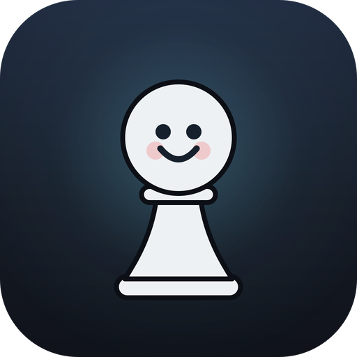
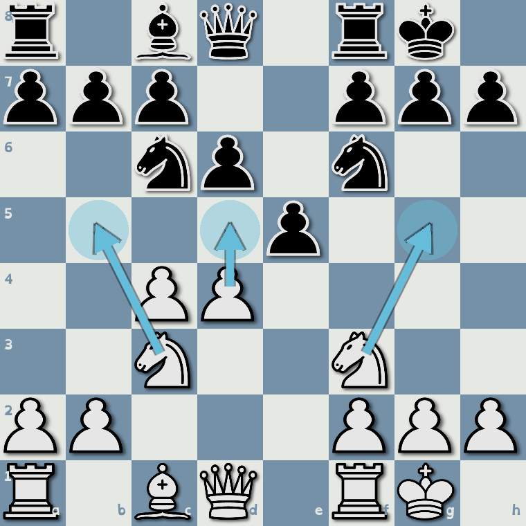
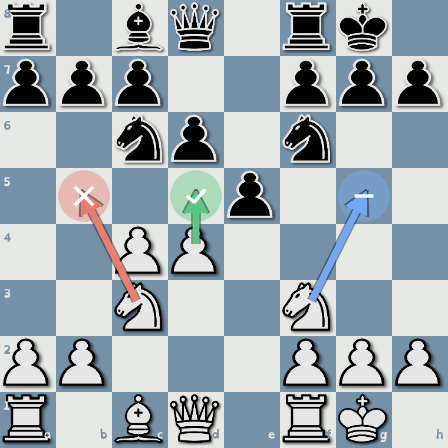
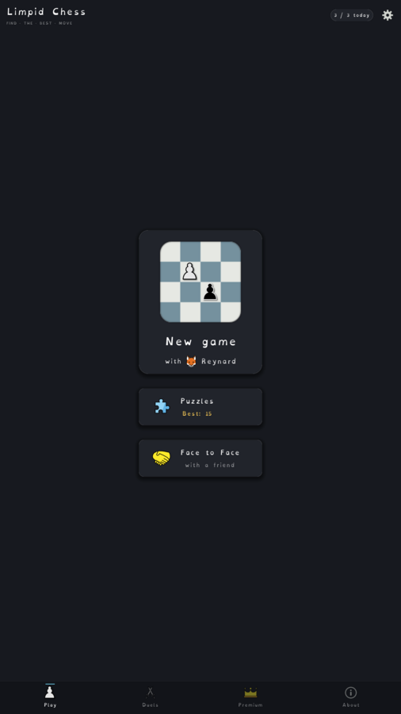
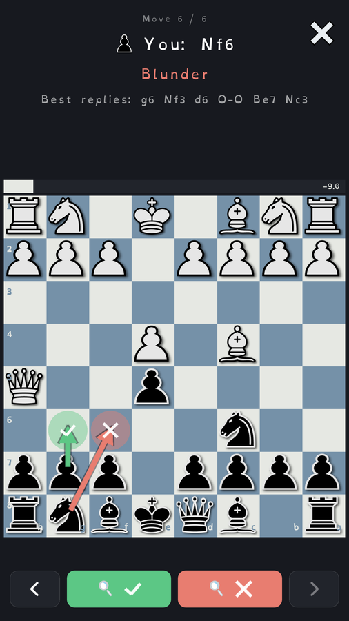
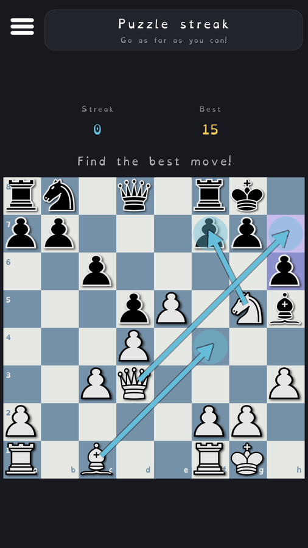
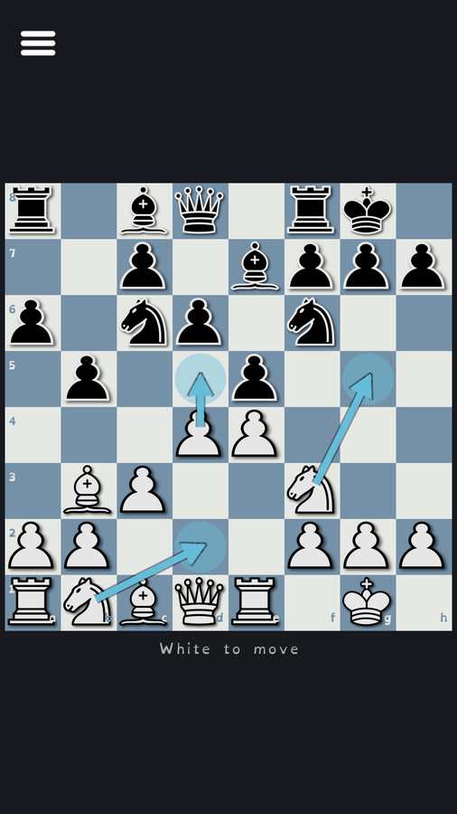

<div align="center">



# Limpid Chess

**A smooth chess game where every turn shows three moves: find the best one.**

[](LICENSE)


[Website](https://hatscat.github.io/limpidchess/) · [Privacy](https://hatscat.github.io/limpidchess/privacy.html) · [Terms](https://hatscat.github.io/limpidchess/terms.html)

### Download

<a href="https://play.google.com/store/apps/details?id=game.limpidchess">
  
</a>

<sub>Android. Free, with an optional one-time Premium. Coming soon to Google Play (currently in testing).</sub>

</div>

---

Most chess apps drop a beginner onto a blank board of thirty legal moves, and they freeze.
Limpid Chess removes that friction: **every turn it surfaces exactly three moves**, the best, a
"not bad" one, and a blunder, drawn as plain numbered arrows. You don't get told which is which.
You pick, and only then do the colours, a symbol, and a coin reveal how you did. Mistakes are the
lesson, never the punishment.

> "The move is there, but you must see it."
> *Tartakower*

It is built beginner-first but grows with you: the opponents climb from a gentle first-timer to a
real challenge, a rising puzzle streak keeps the tactics coming, and a two-player Face to Face mode
is fun at any level.

## How it works

<p align="center">
  
  &nbsp;
  
</p>

1. **Find the best.** Three moves, one colour, no hints.
2. **See why.** Pick one and the qualities reveal: green is best, blue is OK, red is the blunder,
   each with a clear symbol so it reads without relying on colour.
3. **Learn.** Collect a coin, see what the best move was, and slowly start spotting the good moves
   yourself.

<p align="center">
  
  &nbsp;
  
  &nbsp;
  
  &nbsp;
  
</p>

## Features

- **Three guided moves every turn**, the whole product, shown neutrally so you must find the best.
- **Puzzles that climb.** A rising streak of real tactics from the Lichess database, each still just
  three moves. One attempt a day for free players; unlimited with Premium.
- **Review every game.** Step through afterwards to see the best line, replay where your move went
  wrong, and watch the evaluation swing, so every game teaches you something.
- **Calm and kind.** Soft palette, no clocks, no shame on losing. Feedback teaches, it never scolds.
- **Bots that grow with you.** Stockfish dialled down for real beginners and kids, climbing to a
  genuine challenge, with a relative difficulty meter instead of a scary rating.
- **Face to Face.** Local two-player on one device, with the same three-move guidance for both sides.
- **Offline, no ads, no accounts, no tracking.** One small save file on your device.
- **Accessible.** OpenDyslexic typeface, colour-blind-safe move symbols, board coordinates.
- **Free**, with an optional one-time Premium (no subscription, ever) for unlimited games, all bots,
  and Face to Face.

## Built with

- **[Godot 4.6](https://godotengine.org/)**, Android-first, custom-drawn 2D board.
- **[Stockfish](https://stockfishchess.org/)** as the chess brain, driven over UCI. Embedded as a
  native GDExtension on Android (where a subprocess can't run) and a subprocess on desktop.
- A **plain-GDScript rules engine** (`ChessRules`) as the source of truth for legality, SAN, FEN,
  and draw detection, perft-validated. A GDScript `ChessBot` serves as an offline fallback.

A deeper tour of the architecture lives in [CLAUDE.md](CLAUDE.md); local dev recipes are in
[HOW_TO.md](HOW_TO.md).

## Build & run

Requires **Godot 4.6** on your `PATH`.

```bash
# Open in the editor
godot --path .

# Headless sanity check (imports, loads autoloads + scenes)
godot --headless --path . --quit

# Move-generation correctness (run after any rules change)
godot --headless --path . -s res://scripts/dev/perft_test.gd

# Whole-project smoke test
godot --headless --path . -s res://scripts/dev/validate.gd
```

Building the native Android Stockfish and exporting the app are covered in
[HOW_TO.md](HOW_TO.md).

## Roadmap

Shipped:

- [x] The three-move mechanic, opponents, coins, and the move-by-move game review
- [x] **Puzzles**: a rising-difficulty streak of tactics from the
      [Lichess open puzzle database](https://database.lichess.org/) (CC0), one wrong move ends the
      run, beat your best streak, one attempt a day for free players
- [x] Face to Face local two-player
- [x] Localized into 13 languages (English, French, Spanish, Portuguese, German, Italian, Russian,
      Turkish, Polish, Indonesian, Vietnamese, Ukrainian, Greek), with a scalable language picker
- [x] Sound effects and settings
- [x] One-time Premium via Google Play Billing (localized price, restore, promo codes)
- [x] Marketing site (landing, privacy, terms)

Planned:

- [X] Verify the embedded native Stockfish on real Android devices
- [ ] Publish to Google Play (in progress)
- [ ] Any further Latin/Cyrillic/Greek language needs only translating (the bundled font already covers
      the script), so more can be added cheaply on demand
- [ ] Chinese / Japanese / Korean / Arabic (these need an additional font; Japanese is the best single
      bet, Simplified Chinese is not worth it on Google Play)
- [ ] Upgrade to **Godot 4.7** post-launch (checklist in [HOW_TO.md](HOW_TO.md#upgrade-godot))

## Contributing

Limpid Chess is open source and built by one person, so it is opinionated and the scope is kept
deliberately small (see the Core Principles in [CLAUDE.md](CLAUDE.md)). Bug reports, fixes, and
translation help are very welcome via issues and pull requests. By contributing you agree your work
is licensed under GPL-3.0 (below).

## License

Limpid Chess is **free software under [GPL-3.0](LICENSE)**, because it ships Stockfish (GPL-3.0).
You may use, study, modify, and redistribute it, including selling the binary, as long as you also
make the corresponding source available under the same licence.

### Credits

- **[Stockfish](https://stockfishchess.org/)**, the chess engine, GPL-3.0.
- **[Godot Engine](https://godotengine.org/)**, MIT.
- **[OpenMoji](https://openmoji.org/)**, UI icons and bot avatars, CC BY-SA 4.0.
- **[OpenDyslexic](https://opendyslexic.org/)**, the typeface.
- Chess pieces: **JohnPablok's improved Cburnett set**, CC0.
- **[Lichess open puzzle database](https://database.lichess.org/)**, CC0, for the Puzzles mode.

---

<div align="center">

Made by **Lone Bee** · [github.com/Hatscat](https://github.com/Hatscat)

</div>
